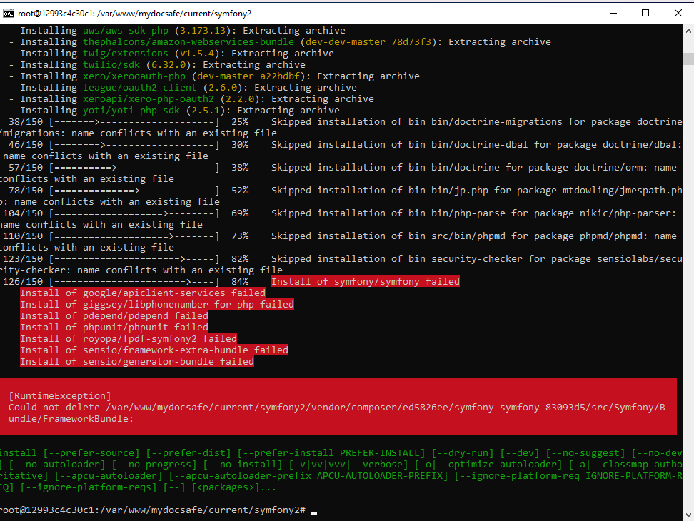

# Error when running Local Development on Windows

### Build a container for the first time
```
docker-compose build
```

### Start the instance

```
docker-compose up
```
### Run composer install from the instance

To enter the instance use another terminal window while `documer-compose up` command is running

```
> docker-compose exec web bash
> cd symfony2
> composer install
```

Some php libraries are installes, some are not. See error message:


